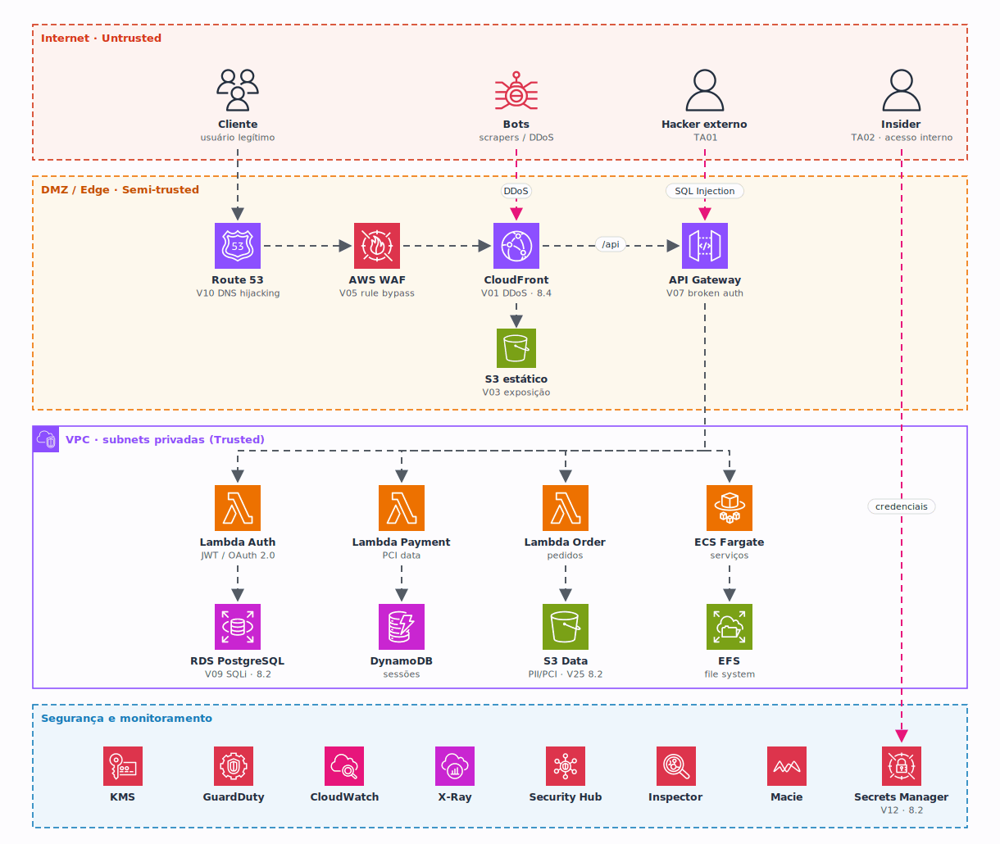

<h1 align="center">
  FinanceShop · Threat Model na AWS
</h1>

  

  

## Qual a finalidade do projeto?

Checkpoint 3 da disciplina de **Segurança** (FIAP, 2º semestre de 2025). O projeto faz o **threat modeling** do **FinanceShop**, um e-commerce financeiro na AWS que processa **dados de cartão de crédito**, e por isso precisa atender ao **PCI DSS Level 1**.

A análise usa o **STRIDE** para identificar as ameaças em cada componente da arquitetura e o **DREAD** para dar uma nota de risco a cada uma, chegando a **29 vulnerabilidades** mapeadas, priorizadas e com mitigação definida.

O diagrama mostra as **zonas de confiança** (Internet, DMZ/Edge, VPC privada e a camada de segurança), os serviços AWS de cada zona e os principais **vetores de ataque** (em rosa): DDoS na CloudFront, SQL Injection na API Gateway e o insider buscando credenciais no Secrets Manager.

## O que foi construído

| Entregável | Conteúdo |
|---|---|
| Arquitetura analisada | CloudFront + S3, Route 53, WAF, API Gateway, Lambda, ECS Fargate, RDS PostgreSQL, DynamoDB, S3, EFS |
| Threat agents | Hacker externo, insider, bots automatizados |
| STRIDE por componente | 29 vulnerabilidades (6 críticas, 15 altas, 8 médias) |
| Matriz DREAD | Nota de 5.4 a 8.4 e prioridade P1 a P3 para cada ameaça |
| Controles de segurança | KMS, Secrets Manager, GuardDuty, WAF, CloudWatch, X-Ray, Security Hub, Inspector e Macie |
| Compliance | Mapeamento dos 12 requisitos do PCI DSS Level 1 |
| Resposta a incidentes | Plano de resposta e recomendações |
| Parte 2 | Questões objetivas sobre threat modeling, com justificativa |

> A análise completa (STRIDE por componente, matriz DREAD, controles, PCI DSS, resposta a incidentes e a Parte 2) está em **[docs/threat-model.md](docs/threat-model.md)**.

---

## Autor

**William Alves Coelho** · RM 556336 · [@willtechdev](https://github.com/willtechdev)
